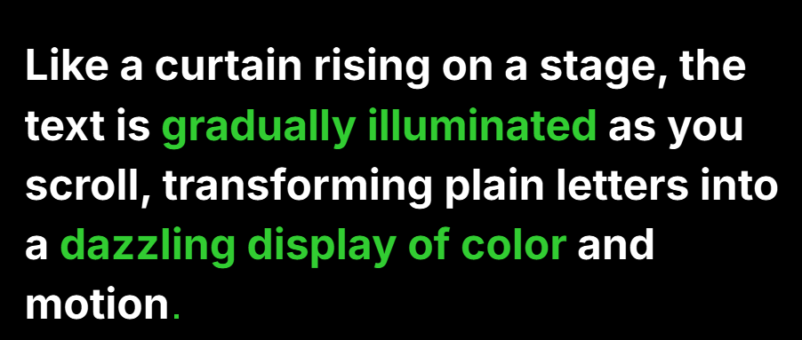

# Text Reveal


## Screenshot

Below is an example of the text reveal effect in action:



---

## How to Set Up a Text Reveal Section

To add a text reveal effect to your page, use the following HTML structure:

```html
<section class="text-reveal-container" data-bg="#000000">
   <div class="container">
      <p class="text-reveal" data-revealed="#ffffff" data-unrevealed="#333333" data-highlight="#32CD32" data-dot>
         Like a curtain rising on a stage, the text is <span>gradually illuminated</span> as you scroll,
         transforming plain
         letters into a <span>dazzling display of color</span> and motion
      </p>
   </div>
</section>
```

**Attributes:**
- `data-bg`: Background color for the section.
- `data-revealed`: Color of the revealed text.
- `data-unrevealed`: Color of the unrevealed text.
- `data-highlight`: Color for highlighted text (inside `<span>` tags).
- `data-dot`: (Optional) Enables the animated dot effect.

You can customize the text and colors as needed. Place this section anywhere in your HTML to create a scroll-activated text reveal effect.

## License
This project is licensed under the MIT License. See [LICENSE](LICENSE) for details.